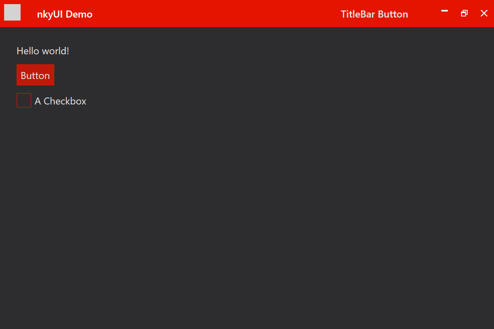

# nkyUI

Neptunium kyUI - UI styles for Avalonia



## Using the theme - Quick Start

First, reference the `nkyUI` library.

### Include styles in `App.xaml`:

Pick a base theme: (`BaseLight`, `BaseDark`)

Pick an accent: (`Red`, `Blue`) [more soon!]

Add the styles accordingly:

```xml
<Application xmlns="https://github.com/avaloniaui">
  <Application.Styles>
    <StyleInclude Source="resm:Avalonia.Themes.Default.DefaultTheme.xaml?assembly=Avalonia.Themes.Default"/>


    <StyleInclude Source="resm:nkyUI.Themes.BaseDark.xaml?assembly=nkyUI" />
    <StyleInclude Source="resm:nkyUI.Themes.Accents.Red.xaml?assembly=nkyUI" />
    <StyleInclude Source="resm:nkyUI.Styles.Controls.xaml?assembly=nkyUI" />
  </Application.Styles>
</Application>
```

This will load the nkyUI themes into your app.

### Update window

Next, open the `.xaml` file for the window you want to theme.
Add the following namespace:

```xml
xmlns:kControls="clr-namespace:nkyUI.Controls;assembly=nkyUI"
```

Next, change the root element from `Window` to `kControls:KYUIWindow`.

An example view:

```xml
<kControls:KYUIWindow xmlns="https://github.com/avaloniaui"
                      xmlns:kControls="clr-namespace:nkyUI.Controls;assembly=nkyUI"
                      Icon="resm:nkyUI.Demo.icon.ico?assembly=nkyUI.Demo"
                      Title="nkyUI Demo"
                      Width="600"
                      Height="400"
                      MinWidth="500"
                      MinHeight="300">
    <kControls:KYUIWindow.WindowCommands>
        <Button Content="TitleBar Button" />
    </kControls:KYUIWindow.WindowCommands>

    <Grid Margin="20">
        <TextBlock>Hello world!</TextBlock>
        <Button Content="Button" HorizontalAlignment="Left" VerticalAlignment="Top" Margin="0,25,0,0" />
        <CheckBox Content="A Checkbox" HorizontalAlignment="Left" VerticalAlignment="Top" Margin="0,60,0,0" />
    </Grid>
</kControls:KYUIWindow>
```

Finally, open the corresponding code-behind (`.xaml.cs`) file, and change
the base class from `Window` to `KYUIWindow`.

An example codebehind:

```csharp
using Avalonia.Markup.Xaml;
using nkyUI.Controls;

namespace nkyUI.Demo
{
    public class MainWindow : KYUIWindow
    {
        public MainWindow()
        {
            this.InitializeComponent();
            App.AttachDevTools(this);
        }

        private void InitializeComponent()
        {
            AvaloniaXamlLoader.Load(this);
        }
    }
}
```

When you run your app, you should see the **nkyUI** styles applied!